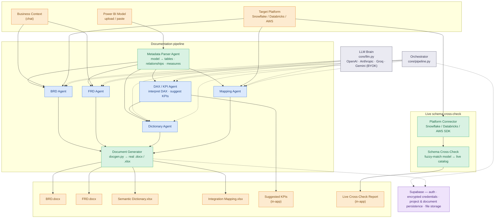

# SemantIQ

**An AI chatbot agent that automates BRD/FRD creation from Power BI semantic models.**

SemantIQ extracts a Power BI semantic layer — tables, relationships, calculated tables, KPIs, measures, and DAX logic — and turns it into structured, business-friendly documentation. It suggests additional KPIs where relevant and maps the model onto a target enterprise data platform (Snowflake, Databricks, or AWS).

## The problem

BRD, FRD, and semantic-layer documentation for analytics solutions is usually written by hand — a slow, error-prone process once a Power BI model has more than a handful of tables, relationships, calculated columns, and DAX measures. SemantIQ replaces that manual write-up with an AI agent pipeline that reads the model directly and produces the documentation a business analyst would otherwise spend days drafting.

## What it does

| Requirement | How SemantIQ delivers it |
|---|---|
| Chatbot interface | Conversational intake for business context, plus a persistent chat sidebar for iterating on generated docs |
| Automates BRD/FRD creation | Dedicated LLM agents draft the BRD and FRD from the model + business context |
| Extracts Power BI semantic layer details | Reads tables, relationships, calculated tables, KPIs, measures, and DAX straight from a model export (.bim/JSON/TMDL — upload or paste) |
| Documents in business-friendly language | Every table, join, KPI, measure, and DAX expression is explained in plain business language, not technical DAX syntax |
| Suggests additional KPIs | A dedicated agent reviews the existing measures and proposes relevant KPIs the model doesn't yet have |
| Platform integration | Live schema cross-check and mapping report against Snowflake, Databricks, or AWS |

## Architecture

Blue = LLM reasoning &nbsp;·&nbsp; Green = deterministic Python &nbsp;·&nbsp; Orange = input / output



## Getting started

**Backend**
```bash
cd backend
python -m venv .venv && .venv\Scripts\activate
pip install -r requirements.txt
copy .env.example .env   # fill in Supabase project + encryption key
uvicorn main:app --reload --port 8000
```

**Frontend**
```bash
cd frontend
npm start
```
Open `http://localhost:4173`. Sign up, then add an LLM provider key in Settings to start generating documentation.

## Status

Built for a hackathon submission. Core documentation pipeline is functional end to end today.

| Capability | Status |
|---|---|
| Model ingestion via upload / paste (.bim, JSON, TMDL) | ✅ Working |
| BRD, FRD, semantic dictionary, KPI suggestions | ✅ Working — real LLM agent pipeline |
| Snowflake / Databricks / AWS schema cross-check & mapping | ✅ Working — real connectors, live catalogs |
| Real `.docx` / `.xlsx` document export | ✅ Working |
| Power BI live workspace connection | 🚧 Roadmap — upload/paste cover the same extraction today |
